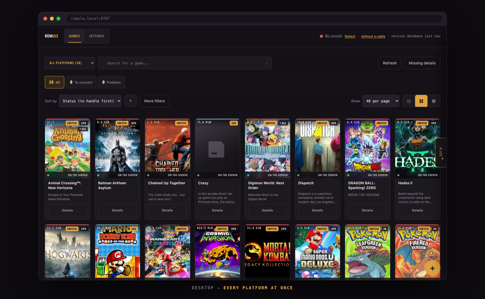
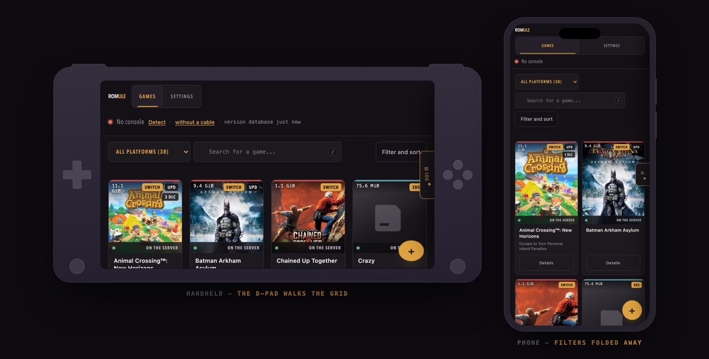

<h1 align="center">Romule</h1>

<p align="center">
  <strong>Self-hosted manager for the game library you already own.</strong><br>
  Sorts it, fills in the cover art, and pushes titles to an Android handheld over adb.
</p>

<p align="center">
  <a href="#licence"></a>
  
  
  
  
</p>

> **Beta.** Romule works and is used daily, but it is young. Some features are
> explicitly labelled beta in the interface. The public `/api/v1` **is** stable;
> the routes the interface uses for itself are not, and are not documented as
> such. Read [Known limitations](#️-known-limitations) before exposing it to the
> internet.

<p align="center">
  
</p>

<p align="center">
  
</p>

---

## ✨ Key features

**Your library, whatever it holds.** Nintendo Switch in detail — title IDs,
base/update/DLC relationships, missing updates, orphaned DLC — plus 22 other
platforms identified per file. One **“all platforms”** view is the default,
because that is what you own; per-platform views are one click away and are
kept in memory, so switching back is instant and nothing flickers.

**Cover art and details, cached.** SteamGridDB for artwork, IGDB for summaries,
year and publisher, stored on disk so the grid never waits on the network.

**Find things.** Search by name or title ID, combine it with status chips and
advanced filters, clear all three in one click — and **save a combination as a
view**, kept on the server so it is the same on your phone and on your desk.

**Push to a handheld** over adb, by USB or Wi‑Fi, with a pairing assistant,
resumable transfers and free-space checks. Emulator layouts are **profiles**,
not hard-coded paths.

**Works where you actually are.** The interface folds down for phones and for
retro handhelds — short landscape screens included — and the grid is walkable
with a **D-pad**: arrow keys move from card to card, Enter opens. The responsive
audit runs on ten device profiles in CI, from a 640 × 480 Anbernic to a Steam
Deck.

**Two roles, and nothing else to reason about.** Administrators change settings
and manage accounts; everyone else gets the library and its actions. Works with
internal accounts (scrypt, optional TOTP) or with your OpenID Connect provider,
where a group decides who administers.

**Scriptable.** A small, versioned [HTTP API](https://romule-app.github.io/romule/api/)
with named, revocable keys — for a dashboard, a cron job, or a shell script.

**Reversible.** Sending a file to the trash does not ask you to confirm: it
happens, and the toast offers *Undo*. Only what cannot be undone asks first.

**Yours.** Romule ships no games, no console keys, and no links to either.

---

## 🚀 Quick start

```sh
git clone https://github.com/romule-app/romule
cd romule
docker compose up -d
docker compose logs romule      # prints the URL with your access token
```

Open the address it prints, create your account in the six-step wizard, and
point Romule at your library. Nothing else needs configuring.

<details>
<summary>Without Docker</summary>

```sh
git clone https://github.com/romule-app/romule
cd romule
python3 -m romule
```

Romule starts on `~/.local/share/romule` and asks you where your games are —
you pick the folder from the interface. Pass `ROMULE_ROOT` to put its own
data (settings, accounts, artwork) somewhere else.

Python 3.10 or newer. No install step, no virtualenv, no build — Romule uses
the standard library only.
</details>

### 🔑 Why a token, and where it comes from

The container is reachable from your network but has no account yet. Rather
than open the service without a password, Romule generates an access token on
first start and prints it with the full URL. It is stored in your library
folder and does not change when the container restarts. A service that only
listens on `127.0.0.1` gets no token — nothing to protect it from.

---

## 🎮 Platforms and emulators

### 🕹️ Supported platforms

Nintendo Switch · PlayStation 1/2/3 · PSP · PS Vita · GameCube · Wii · Wii U ·
Nintendo 3DS · DS · 64 · SNES · NES · Game Boy Advance · Game Boy / Color ·
Dreamcast · Saturn · Mega Drive · Arcade (MAME/FBN) · Xbox · Xbox 360 · PC

### 🎛️ Emulator profiles

The target device and emulator are profiles, not hard-coded paths.

| Profile | Verified on real hardware |
|---|---|
| **Eden** | yes — the reference profile |
| Yuzu, Sudachi, Citron, Ryujinx | no, provided as-is |
| Generic (games folder only) | no |

Unverified profiles are labelled as such in the interface. Pick yours in
**Settings → Your console**.

---

## ⚙️ Configuration

Romule reads its settings from the interface; environment variables cover what
must be known before it starts.

| Variable | Default | What it does |
|---|---|---|
| `ROMULE_ROOT` | `~/.local/share/romule` | Service data folder: settings, accounts, artwork, logs |
| `ROMULE_LIBRARY` | — | Pins the games folder and locks it against changes from the interface |
| `ROMULE_BASES` | — | Folders the interface may browse, separated like a `PATH` |
| `ROMULE_WEB_PORT` | `8787` | Port to listen on |
| `ROMULE_BIND` | see below | Interface to bind to |
| `ROMULE_TOKEN` | — | Access token; overrides the generated one |
| `ROMULE_LAN` | — | `1` opens network access **without a password** |
| `ROMULE_KEYS` | `~/.romule/prod.keys` | Path to the decryption keys |
| `ROMULE_TRUSTED_PROXIES` | — | Comma-separated IPs whose forwarded headers are honoured |
| `ROMULE_UPLOAD_MAX` | 64 GiB | Largest accepted upload |
| `ROMULE_DISK_MARGIN` | 2 GiB | Free space kept in reserve |
| `ROMULE_NO_BROWSER` | — | `1` stops Romule opening a browser at startup |
| `ROMULE_TIMEOUT` | `300` | Socket timeout, seconds |
| `ROMULE_MAX_CONN` | `64` | Simultaneous connections |
| `ROMULE_RATE` | `600` | Requests per minute per client |

`ROMULE_BIND` defaults to `127.0.0.1`, except in a container or when network
access has been enabled — otherwise a published port would reach nothing.

All 37 settings in the configuration file are edited from the interface and
documented on the
[documentation site](https://romule-app.github.io/romule/).

### 🧰 External tools

All optional. Missing ones disable a feature; none prevent Romule from
starting. The Docker image ships all of them.

| Tool | Needed for |
|---|---|
| `adb` | Talking to the console |
| `nsz` | Converting `.nsz` / `.xcz` (also needs `prod.keys`) |
| `unar`, `7z` | Unpacking archives dropped into `_import` |

---

## 🔒 Security

**Romule has no built-in TLS.** It speaks plain HTTP and expects a reverse
proxy in front of it for anything reachable from the internet. If you run one,
name it in `ROMULE_TRUSTED_PROXIES` — otherwise its forwarded headers grant
nothing, by design, because a proxy on the same host makes every request look
local.

A few things it does on its own:

- Binds to `127.0.0.1` unless you say otherwise.
- The first account created is the administrator; only an administrator changes
  settings or manages accounts. The very first account can only be created from
  the machine hosting the library.
- Passwords are hashed with scrypt; TOTP two-factor is available.
- Upload caps, free-space checks, socket timeouts, a connection cap and a rate
  limiter.

Run `python3 -m romule.audit` after any change: it reports on the configuration
actually running, and the CI fails on anything it rates *grave*.

Reporting a vulnerability: see [SECURITY.md](SECURITY.md).

### ⚠️ Known limitations

- **No TLS.** A reverse proxy is required for internet exposure.
- **`style-src` allows `'unsafe-inline'`.** Inline `style=` attributes are
  common in the generated markup. A style is not executed, so this is a much
  narrower exception than the `script-src` one removed in 0.2.0.
- **Beta features**, labelled in the interface: OpenID Connect SSO (RS256
  verification written for Romule, no third-party library), emulator
  configuration piloting (Romule writes into another program's files),
  EmuReady community settings, transfer resume.
- Emulator profiles other than Eden are untested on real hardware.

---

## 🤖 This application is vibe coded

Said plainly, because you are about to run it on your own machine.

Romule was written with an AI assistant — most of its code, its tests and its
documentation. It was not typed line by line by a person who holds the whole
design in their head. That has consequences worth knowing:

- **Nobody has read every line.** The code is reviewed, but not with the
  familiarity a hand-written codebase gives its author.
- **What holds it up is the checks, not the memory of the author.** Five test
  suites — unit, end-to-end HTTP, security audit, real-browser interface, leak
  detection — run on every change, across four Python versions. CodeQL analyses
  both languages, Trivy scans the image. That is deliberate: it is the part
  that scales when the writing does not.
- **Bugs will look different.** Expect the plausible-but-wrong over the typo:
  code that reads well and does the wrong thing at an edge. If something looks
  odd, it may well be.
- **Comments explain *why*.** They carry the reasoning that would otherwise be
  lost, including the mistakes that were made and corrected. They are in French
  — deliberately, see [CONTRIBUTING.md](CONTRIBUTING.md).

If that is not for you, that is a fair call. If it is, bug reports are
especially useful here.

---

## ⚖️ Legal

Romule is a library manager. It **does not** provide games, console keys, or
any means of obtaining them, and it contains no links to either. It manages
files that are already on your disk.

Whether you may legally hold those files depends on where you live and how you
obtained them. That question is yours, not this project's. Please do not open
issues asking where to find games or keys; they will be closed.

### 🗝️ Console keys

Romule never ships, generates, or helps you obtain console keys. Decrypting
`.nsz` / `.xcz` is delegated to [`nsz`](https://github.com/nicoboss/nsz), a
separate tool you install yourself and point at a key file you supply. Romule
works without any of it — keys are needed only for those two formats.

Be aware that in some jurisdictions, extracting or using such keys may be
restricted **even for content you own**. Romule takes no position on that and
gives no guidance on it.

### 👾 Emulators

Romule bundles no emulator and distributes none. An emulator *profile* is
nothing more than a description of where a given third-party program keeps its
files, so that Romule can copy games to the right place. Naming a program is
not an endorsement, a partnership, or a claim that anyone authorised it.

### ™️ Trademarks

Nintendo Switch, and the names of every console, publisher and emulator
mentioned here, are trademarks of their respective owners. Romule is an
independent project, not affiliated with, endorsed by, or connected to any of
them. Those names are used only to say what the software works with.

---

## 📚 Project documents

| Document | What it covers |
|---|---|
| [Documentation site](https://romule-app.github.io/romule/) | Install, first run, console setup, full configuration reference |
| [HTTP API](https://romule-app.github.io/romule/api/) | Keys, the fourteen routes, pagination, errors |
| [CHANGELOG.md](CHANGELOG.md) | What changed, release by release |
| [CONTRIBUTING.md](CONTRIBUTING.md) | Zero-dependency rule, house style, how to run the suites |
| [SECURITY.md](SECURITY.md) | How to report a vulnerability, and what is in scope |

## 🛠️ Development

```sh
python3 lancer_tests.py               # unit, server and audit suites
python3 lancer_tests.py --navigateur  # adds the real-Chrome interface suites
python3 -m romule.audit               # self-audit
python3 outils/verifier-fuite.py      # refuses personal data in the git index
python3 outils/mesurer-perf.py        # timings on a synthetic library
```

## Licence

Romule is free software under the
[GNU Affero General Public License v3.0 or later](LICENSE).

The AGPL was chosen deliberately: Romule is a **network service**, and the AGPL
is what keeps a hosted fork open. If you run a modified Romule and let others
reach it over a network, section 13 requires you to offer them your source. The
interface footer carries that offer — it links to the source and shows the
running version, and `/api/health` reports both. Keep it working if you fork.
