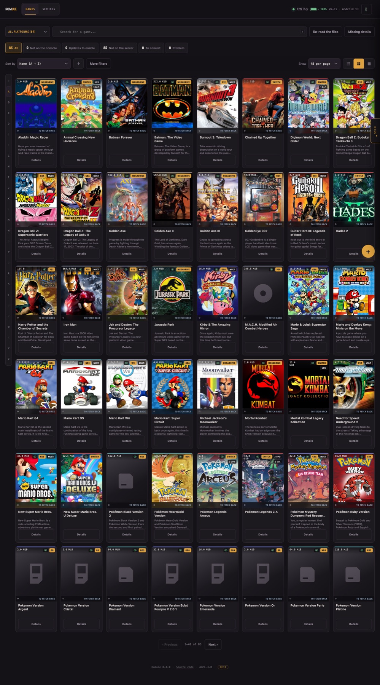

# Romule

**Gestionnaire auto-hébergé pour la ludothèque que tu possèdes déjà.** Il fait
l'inventaire de tes fichiers, complète les jaquettes, et envoie les jeux vers
une console portable Android par adb.

!!! warning "Bêta"
    Romule fonctionne et sert tous les jours, mais il est jeune, et plusieurs
    fonctions sont étiquetées bêta dans l'interface. L'[API HTTP](api.md)
    publique, elle, **est** stable ; les routes que l'interface utilise pour
    elle-même ne le sont pas. Lis [Sécurité et exposition](securite.md) avant
    de l'exposer sur internet.

## Par où commencer

- **[Installation](installation.md)** — Docker, ou Python sans étape d'installation
- **[Premier démarrage](premier-demarrage.md)** — l'assistant, une étape à la fois
- **[Ta console](console.md)** — appairage en Wi-Fi ou par USB
- **[Configuration](configuration.md)** — chaque réglage et chaque variable
- **[API HTTP](api.md)** — interroger ta ludothèque depuis un script ou un tableau de bord
- **[Rôles et accès](roles.md)** — qui a le droit de quoi, et les groupes SSO

## Ce que Romule n'est pas

Il ne fournit **aucun jeu, aucune clé de console, et aucun lien vers l'un ou
l'autre**, et il n'embarque aucun émulateur. Il gère des fichiers qui sont déjà
sur ton disque. Savoir si tu as le droit de les détenir dépend de l'endroit où
tu vis et de la façon dont tu te les es procurés — cette question est la
tienne, pas celle de ce projet.

## Écrit avec un assistant IA

Romule est *vibe coded* : l'essentiel de son code, de ses tests et de sa
documentation a été écrit avec un assistant plutôt que tapé par quelqu'un qui
tient toute la conception dans sa tête. Ce qui le tient debout, ce sont les
contrôles — cinq familles de tests sur quatre versions de Python, un audit de
sécurité, CodeQL sur les deux langages, une analyse de l'image — et non la
mémoire qu'aurait l'auteur de chaque ligne.

Attends-toi au plausible-mais-faux plutôt qu'à la faute de frappe : du code qui
se lit bien et fait la mauvaise chose dans un cas limite. Si quelque chose te
semble étrange, c'est peut-être le cas — les rapports de bogue sont
particulièrement utiles ici.

!!! info "Marques"
    Nintendo Switch, ainsi que les noms de chaque console, éditeur et
    émulateur cités dans cette documentation, sont des marques de leurs
    propriétaires respectifs. Romule est un projet indépendant, sans
    affiliation ni approbation d'aucun d'entre eux. Ces noms ne servent qu'à
    dire avec quoi le logiciel fonctionne. Voir
    [Mentions légales](https://github.com/romule-app/romule#-legal).
