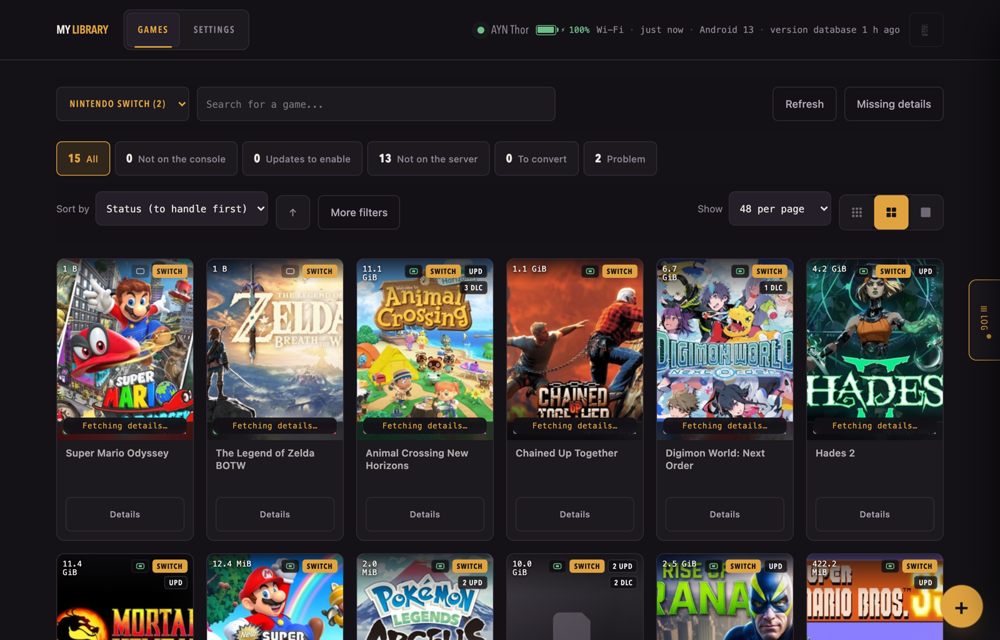

# Romule

**Self-hosted manager for the game library you already own.** It takes stock of
your files, fills in the cover art, and pushes titles to an Android handheld
over adb.

!!! warning "Beta"
    This is Romule's first public release. It works and is used daily, but the
    HTTP API will change, and several features are labelled beta in the
    interface. Read [Security and exposure](securite.md) before putting it on
    the internet.

## Where to start

- **[Installation](installation.md)** — Docker, or Python with no install step
- **[First run](premier-demarrage.md)** — the six-step wizard, one at a time
- **[Your console](console.md)** — pairing over Wi-Fi or USB
- **[Configuration](configuration.md)** — every setting and environment variable

## What Romule is not

It ships **no games, no console keys, and no links to either**. It manages
files already on your disk. Whether you may legally hold them depends on where
you live and how you got them — that question is yours, not this project's.

## Written with an AI assistant

Romule is *vibe coded*: most of its code, tests and documentation were written
with an AI assistant rather than typed by a person holding the whole design in
their head. What holds it up is the checks — five test suites across four
Python versions, a security audit, CodeQL on both languages, a container scan —
not the author's memory of every line. Expect the plausible-but-wrong over the
typo. Bug reports are especially useful here.
