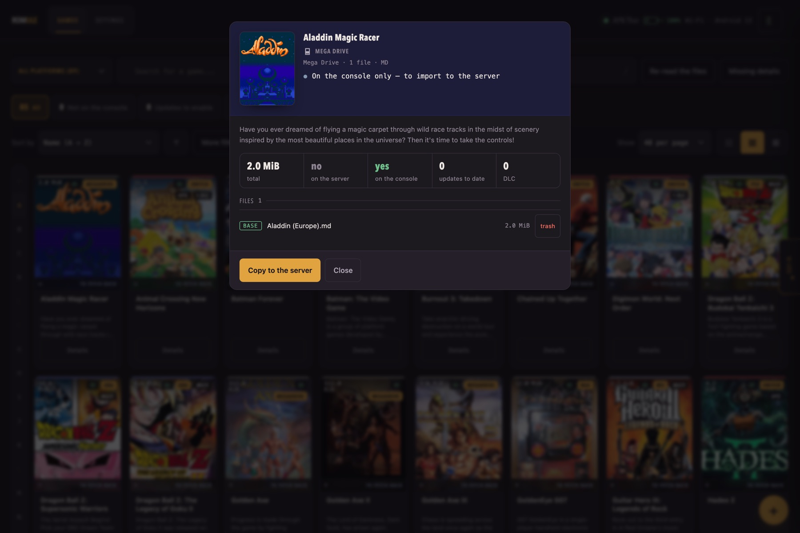
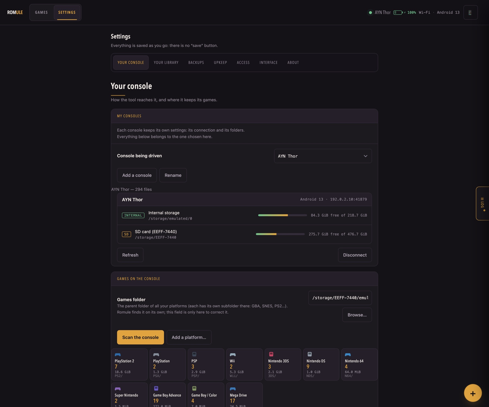
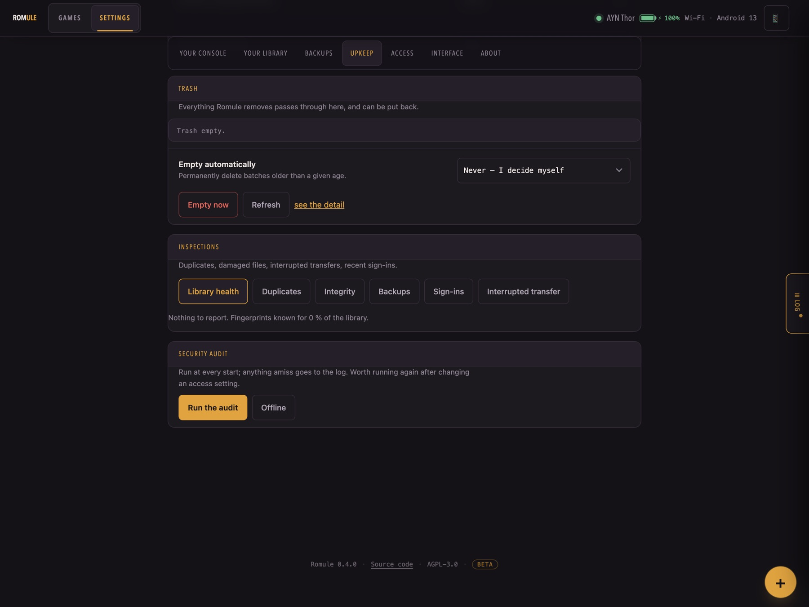

# Romule

**Self-hosted manager for the game library you already own.** It takes stock of
your files, fills in the cover art, and pushes titles to an Android handheld
over adb.

## A closer look

-   __The library__

    

    Every platform at once, or one at a time. Updates and DLC fold into the
    game they belong to.

-   __A game__

    

    What you hold, which version, which files, and whether the console has it.

-   __Your console__

    

    Battery, storage and address, read from the console itself. Its games
    folder is found, not typed.

-   __What is wrong__

    

    Broken files, orphaned DLC, duplicates, games with no details — each with
    what to do about it.

!!! warning "Beta"
    Romule works and is used daily, but it is young, and several features are
    labelled beta in the interface. The public [HTTP API](api.md) **is** stable;
    the routes the interface uses for itself are not. Read
    [Security and exposure](securite.md) before putting it on the internet.

## Where to start

- **[Installation](installation.md)** — Docker, or Python with no install step
- **[First run](premier-demarrage.md)** — the six-step wizard, one at a time
- **[Your console](console.md)** — pairing over Wi-Fi or USB
- **[Configuration](configuration.md)** — every setting and environment variable
- **[HTTP API](api.md)** — query your library from a dashboard or a script
- **[Roles and access](roles.md)** — who may do what, and how SSO groups map
- **[Backups](sauvegardes.md)** — what to copy, where, and how often

## What Romule is not

It ships **no games, no console keys, and no links to either**, and it bundles
no emulator. It manages files already on your disk. Whether you may legally
hold them depends on where
you live and how you got them — that question is yours, not this project's.

## Written with an AI assistant

Romule is *vibe coded*: most of its code, tests and documentation were written
with an AI assistant rather than typed by a person holding the whole design in
their head. What holds it up is the checks — five test suites across four
Python versions, a security audit, CodeQL on both languages, a container scan —
not the author's memory of every line. Expect the plausible-but-wrong over the
typo. Bug reports are especially useful here.

!!! info "Trademarks"
    Nintendo Switch, and the names of every console, publisher and emulator
    mentioned in this documentation, are trademarks of their respective
    owners. Romule is an independent project, not affiliated with, endorsed by,
    or connected to any of them. Those names are used only to say what the
    software works with. See [Legal](https://github.com/romule-app/romule#legal).
